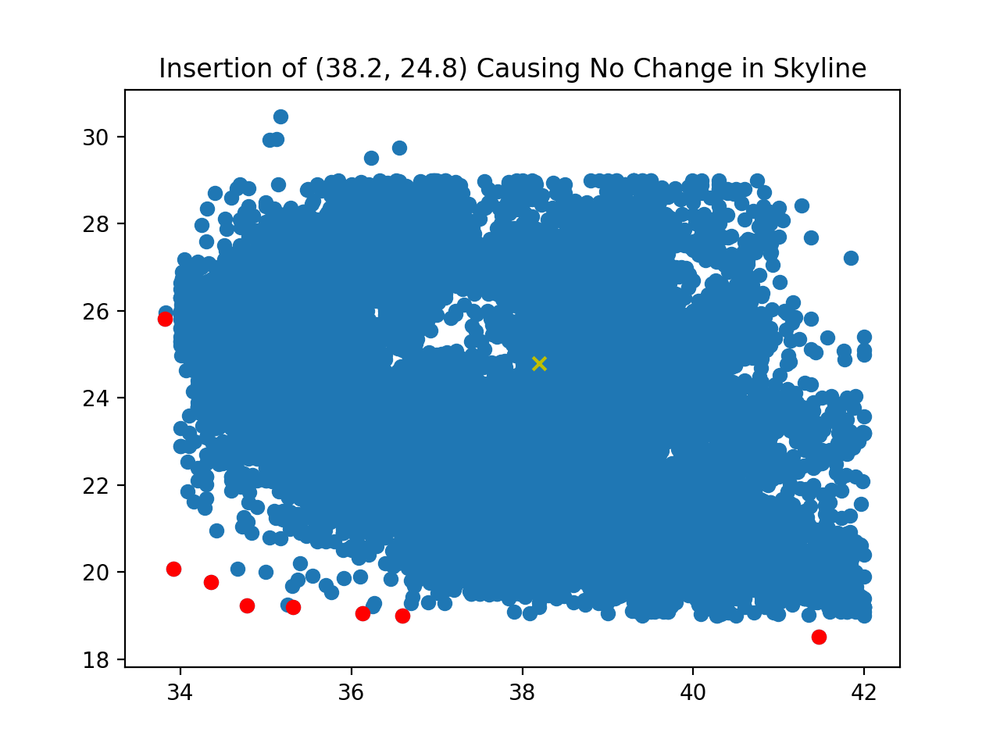
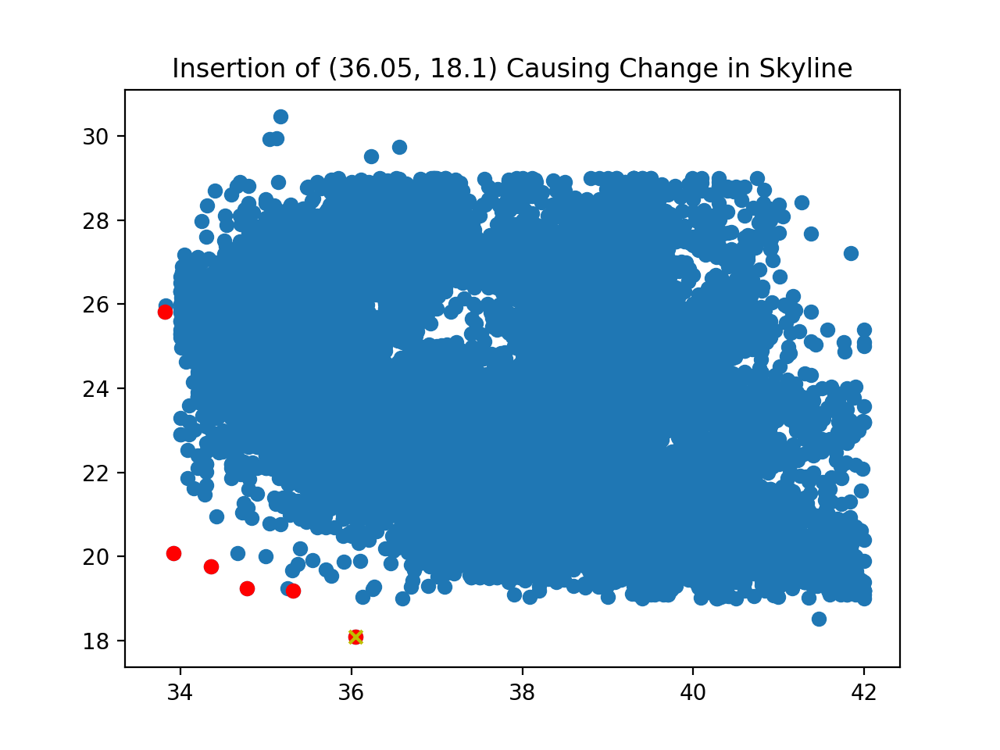

# Branch and Bound Skyline Algorithm on RTree

## How to run

```bash
cd skyline
mvn clean install
```

Standard maven project that has rtree in the pom file, run tests in main function of src/test/java/SkylineTest.java
Upon calling the saveSkyline method in SkylineTest.java, the results can be found in the target/skyline/ folder.

## Methods
We implemented a BBSkyline object as specified in src/java/BBSkyline.java.
The object has two members, an arraylist of points called the skyline, and an rtree, based on the given rtree.
We first insert all the points specified by src/test/java/db/dataset1.txt, then run a BBS heap to find the skyline points.
The object also has insert and delete methods, in which can maintain the skyline without recomputation.


## Results

After running src/test/java/SkylineTest.java on the given dataset, we get the plot below. The specific points are detailed in the assets folder.

### Original Dataset plot


We have also implemented insert and delete functions, which maintain the skyline. The effects of these functions are visualized below.

### After Insertion of (38.2, 24.8)



### After Insertion of (36.05, 18.1)



### After Deletion of (39.3, 21.2)


### After Deletion of (34.78, 19.24)


